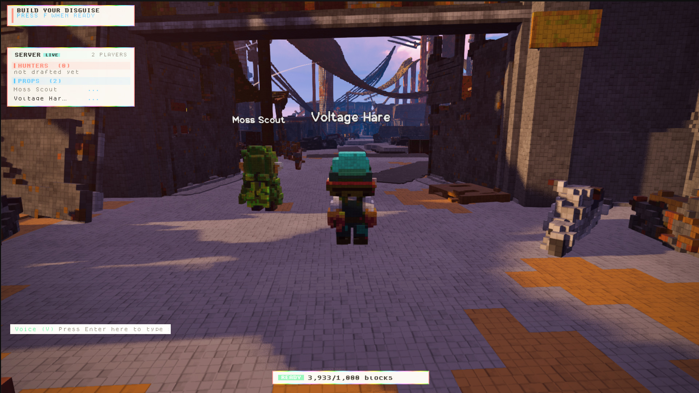
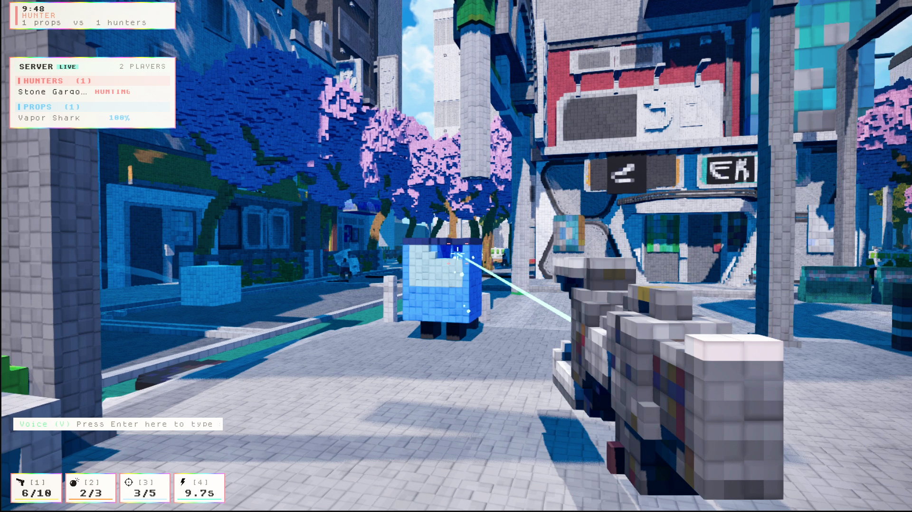
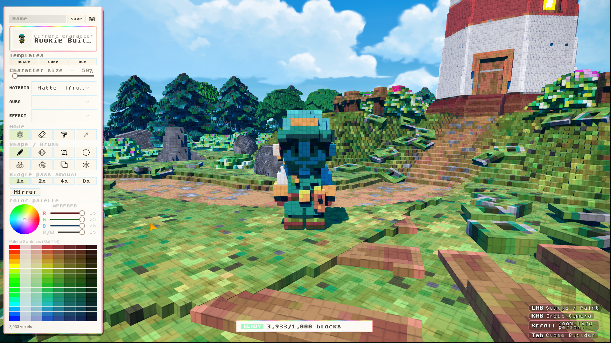
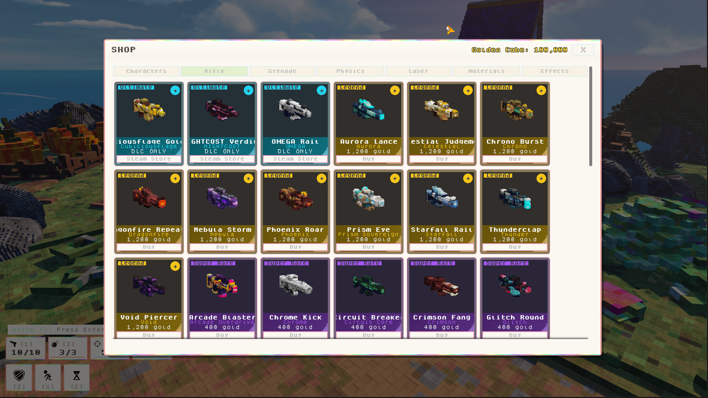
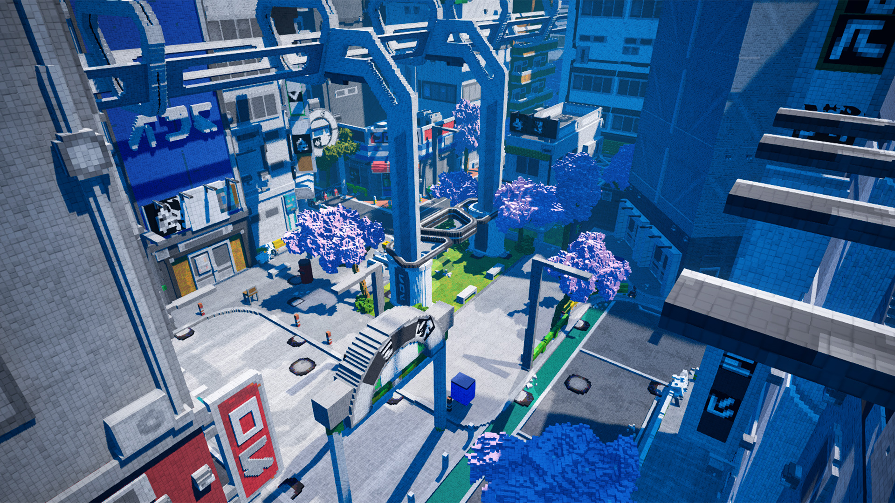
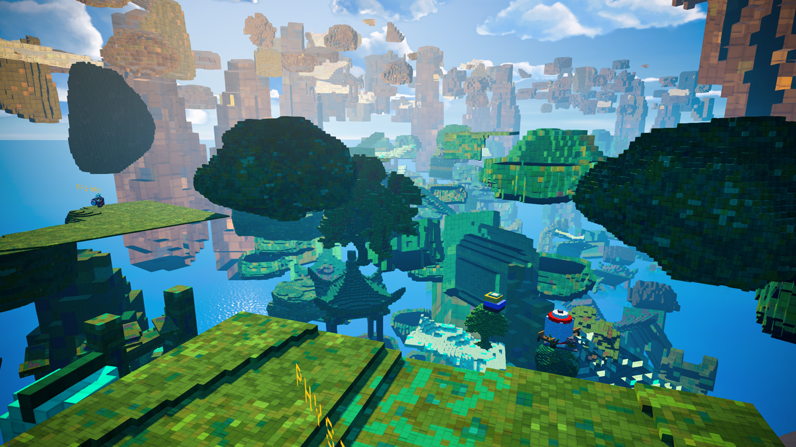

# Cubiciousflage Multiplayer Voxel  Hunt & Tower Platformer


<h3><a href="https://github.com/kubrvk/Cubiciousflage">4-) Cubiciousflage</a> <a href="https://store.steampowered.com/app/5041030/Cubiciousflage"> </a></h3>

        
<br><br>
Multiplayer voxel action game. Combining high-stakes Prop Hunt hide-and-seek with an in-game Cube Builder and a procedural vertical parkour mode (Climp Tower), Cubiciousflage lets players sculpt, disguise, shoot, and destroy everything down to the individual voxel.
<br clear="left"/>
<p align="center">

</p>
<p align="center">
  
  
  
  
</p>

---

## Overview

> *"Disguise. Sculpt. Hunt. Ascend."*

**Cubiciousflage** is a vibrant, multiplayer voxel action game built natively in **Unreal Engine 5.8 (C++)**. Combining high-stakes **Prop Hunt** hide-and-seek with an in-game **Cube Builder** and a procedural vertical parkour mode (**Climp Tower**), Cubiciousflage lets players sculpt, disguise, shoot, and destroy everything down to the individual voxel.

Every object, building, prop, and character in the game is constructed from destructible voxels powered by runtime sparse voxel technology and optional Nanite mesh clustering.

---

## Game Modes and Systems

<p align="center">
  
  
</p>

### Multiplayer Voxel Prop Hunt (Hunters vs. Props)
* **Dynamic Disguises:** Disguise yourself as any prop in the environment—from mailboxes and vending machines to traffic cones, streetlamps, and custom player-sculpted objects.
* **Hunter Arsenal:** Hunters track disguised players across lush voxel maps using specialized weaponry:
  * **Assault Rifles:** Fast hitscan weapons that chip away voxels from suspicious geometry.
  * **Explosive Grenades:** Cause AoE block destruction and reveal hidden props.
  * **Tracking Lasers & Physics Disrupters:** Test props with force pulses and tracking beams.
* **Subtractive Destruction:** Shooting voxels chips away pieces of geometry in real time. Server-authoritative physics spawn Niagara block debris and trigger structural collapses when supporting voxels are eliminated.

---

<p align="center">
  
  
</p>

### In-Game Cube Builder and Character Studio
* **Live In-Game Sculpting:** Players can sculpt custom characters (**CubeKin**), weapons, and hiding props block-by-block using the native Slate/UMG Cube Builder panel.
* **256-Color Oklab Palette:** 24 hue bands with 8 tones and 64 greys calibrated in perceptual Oklab color space for high color fidelity.
* **Sculpting Tools:** Full toolset featuring Box, Sphere, Cylinder, Shell, Line, Mirror, Erase, Paint, and Eyedropper brushes.
* **Cosmetics & Weapon Shop:** Earn **Golden Cubes** to unlock skins across multiple rarity tiers (*Ultimate*, *Legend*, *Super Rare*):
  * **Legendary Rifles:** *Aurora Lance*, *Celestial Judgement*, *Chrono Burst*, *Dragonfire Repeater*, *Starfall Rail*, *Nebula Storm*.
  * **Custom Auras & Trails:** Emissive materials, elemental halos, and particle trail cosmetics.

---

<p align="center">
  
  
</p>

### Climp Mode (Vertical Tower Platformer)
* **Procedural Vertical Ascent:** Scale an immense voxel tower stretching thousands of meters into the clouds (`VoxelClimpTower`).
* **Precision Platforming:** Navigate floating islands, ancient shrines, lighthouses, narrow ledges, and jump pads with high-speed parkour mechanics.
* **Distance Streaming & Level Director:** High-performance procedural chunk streaming ensuring smooth framerates even with massive voxel structures.

---

## Technical Architecture (C++)

Built strictly in modern C++ with zero gameplay Blueprint bloat:

```
Cubiciousflage/
├── Source/
│   ├── CubeCubeCube/              # Main gameplay runtime module
│   │   ├── VoxelRuntimeEditor/    # In-game Cube Builder & sculpting runtime
│   │   ├── VoxelPropCharacter     # Player pawn: movement, camera, disguise & combat
│   │   ├── VoxelSculptComponent   # Dense asset mutation, GPU palette, raycasts, replication
│   │   ├── VoxelLevelDirector     # Procedural level streaming & object placement
│   │   ├── VoxelClimpTower        # Procedural vertical tower generator & platforming logic
│   │   └── VoxelObjectCatalog     # Data-driven object catalog & theme scripts
│   └── CubeCubeCubeEditor/        # Editor tools, level converters, baking & mesh descriptions
└── Plugins/
    └── VoxelEditor/               # Voxel runtime engine, Nanite clustering, collapse solver
```

| Component | Responsibility |
|---|---|
| **`VoxelPropCharacter`** | Core player pawn handling voxel body transformations, capsule resizing, weapon firing, disguise blending, and health. |
| **`VoxelSculptComponent`** | Manages dense voxel buffer mutations, fast GPU palette binding, undo/redo stacks, and network replication payloads. |
| **`VoxelLevelDirector`** | Translates level definitions into world actors with LOD proxies and distance-based chunk streaming. |
| **`VoxelObjectCatalog`** | Hundreds of procedural voxel prop scripts organized across urban, fantasy, industrial, and nature themes. |

---

## Controls Guide

| Key | Action |
|---|---|
| **`WASD`** | Move / Strafe |
| **`Space`** | Jump / Mantle |
| **`Left Mouse Button`** | Fire Weapon / Sculpt Voxel |
| **`Right Mouse Button`** | Aim Down Sights / Orbit Builder Camera |
| **`1 / 2 / 3 / 4`** | Weapon Slot Selection (Rifle, Grenade, Laser, Utility) |
| **`F`** | Ready Up / Lock Disguise in Prop Hunt |
| **`Tab`** | Toggle Cube Builder Studio |
| **`V`** | Voice Chat Push-to-Talk |
| **`Enter`** | Open Text Chat |

---

## Build and Requirements

1. **Unreal Engine 5.8+**
2. **Visual Studio 2022** (MSVC v143 toolchain with Desktop C++ & Game Development workloads)
3. **Hardware:** DirectX 12 & Shader Model 6 compatible GPU (required for Nanite voxel mesh clusters).

---

## License and Credits

Developed by [Kubrick](https://github.com/kubrvk). All rights reserved.
